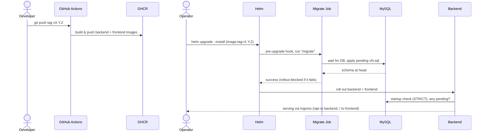
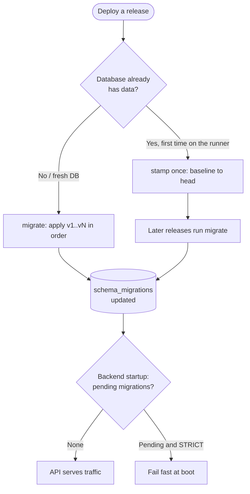

# Footballhubmanager

`footballhubmanager` is a full-stack platform to manage amateur football communities, players,
seasons, matches, standings, and match-based insights.

The current domain model still uses `pena` terminology in code and APIs (`/penas/...`) because the
product started as a peña-focused system. The product name is now **footballhubmanager**.

## Product Purpose

The project solves operational friction for community football organizers:

- centralizing player membership and profile data
- running seasons with configurable scoring rules
- managing match lineups and per-player stats
- generating standings and match intelligence from real match data
- exposing the same match understanding to both admins and regular users

## Product Direction

`footballhubmanager` is evolving from "CRUD + standings" into a data-informed management product:

- stronger backend ownership of calculations and analytics
- richer non-editable match review flows (what happened in a match)
- comparative season analytics for decision-making
- higher engineering quality gates (linting, formatting, CI checks) across backend and frontend

## Implementation Checklist

### Core platform

- [x] Session-based authentication for `user` and `admin`
- [x] User and admin registration/login/logout flows
- [x] Role-based endpoint protection
- [x] Catalog endpoint for nationalities

### Community and membership management

- [x] Peña listing and access for admins/users
- [x] Link-token flow to join a peña
- [x] Player membership management (user self-service + admin operations)
- [x] Guest player creation by admins
- [x] Player profile read/update endpoints

### Season lifecycle

- [x] Create/list/update/delete seasons per peña
- [x] Active-season retrieval by date
- [x] Season configuration for points (win/draw/loss)

### Competition and matches

- [x] Register/unregister players in seasons
- [x] Bulk season player registration
- [x] Player stats updates at season level
- [x] Match creation (basic and detailed lineups)
- [x] Match lineup updates with validation/lock rules
- [x] Match stats updates (goals/assists/saves/rating)
- [x] Match detail and match history pagination
- [x] Match delete flow with consistency checks
- [x] Season standings endpoint

### Match insights and analytics

- [x] Match insights endpoint with scope by selected/all seasons
- [x] Correlation matrix and teammate/pair performance views
- [x] Leaders (scorers, assisters, savers)
- [x] Timeline metrics by match and by season
- [x] Backend-driven insight calculations (frontend consumption-focused)
- [x] Real position/rating propagation and average rating computation in insights pipeline

### Frontend product surface

- [x] Admin dashboard (players, seasons, matches, insights)
- [x] User dashboard (membership, standings, match visibility, insights consumption)
- [x] Match detail visualization with team/player breakdown
- [x] Internationalization support (English/Spanish messages)
- [x] PWA build integration

### Engineering quality and operations

- [x] Backend lint/format/test checks (`ruff` + `pytest`)
- [x] Frontend lint/format/build checks (`eslint` + `prettier` + `vite build`)
- [x] CI pipeline covering backend quality/tests and frontend quality/build
- [x] Dependency audit hardening in frontend (`npm audit` currently clean)
- [x] Container images (backend + frontend) published to GHCR on semver tag
- [x] Forward-only DB migration runner with `schema_migrations` tracking (no Alembic)
- [x] Kubernetes Helm chart with a pre-upgrade migration hook (in-cluster or external MySQL)

## Tech Stack

- Backend: FastAPI + SQLAlchemy + MySQL
- Frontend: React + Vite + MUI + Recharts
- Tooling: Ruff, Pytest, ESLint, Prettier, Just
- CI: GitHub Actions

## Quick Start

1. Review [Project Overview](docs/overview.md).
2. Start infrastructure with [Docker Guide](docs/docker.md).
3. Recommended task runner usage:
   - `just bootstrap`
   - `just install-hooks`
   - `just run-backend`
   - `just run-frontend`
   - `just check` (backend format + lint + unit tests)
   - `just frontend-check` (frontend prettier check + eslint + build)

## Deployment

Target: **Kubernetes**. Images are published to **GHCR** on a semver tag and the app
is deployed with the Helm chart in [`deploy/helm/footballhub`](deploy/helm/footballhub).
Full details in the [Deployment Guide](docs/deployment.md).

### Flow at a glance



The key guarantee: the migration Job runs **before** the API rolls out and Helm
blocks the release until it succeeds, so the backend never serves against a stale
schema (and refuses to boot if it somehow would).

### 1. Build & publish images (on a tag)

Pushing a `vX.Y.Z` tag triggers `.github/workflows/release.yml`, which builds and
pushes both images to GHCR (tags `1.2.0`, `1.2`, `sha-<sha>`, `latest`):

```bash
git tag v1.2.0
git push origin v1.2.0
```

| Image | Build context | Dockerfile |
|-------|---------------|------------|
| `ghcr.io/adrianoggm/footballhubmanager-backend` | repo root | `backend/docker/Dockerfile` |
| `ghcr.io/adrianoggm/footballhubmanager-frontend` | `frontend/` | `frontend/Dockerfile` |

The backend is a single image with multiple roles via its entrypoint: `serve`
(default), `migrate`, `stamp [N]`, `status`. The frontend is a static SPA served by
nginx; the Ingress routes `/api` to the backend and everything else to the frontend.

### 2. Database migrations (no Alembic)

The schema evolves through forward-only `versioning/sql/versions/vN.sql` files. A
migration runner (`backend/src/db_migrations`) tracks applied versions in
`schema_migrations` and applies only the pending ones. **MySQL's docker-entrypoint
init (`actual.sql`) only runs on an empty volume**, so production always evolves via
the runner — never the init script.

In Kubernetes this runs as a **`pre-install,pre-upgrade` Helm hook Job** (backend
image, `migrate`), so the chart blocks the rollout until the schema is current and
the API never serves against a stale schema. The backend additionally refuses to
start when migrations are pending (`STRICT_MIGRATION_CHECK=true`, the chart default).



> **First deploy against a database that already has data:** baseline it once so the
> runner does not try to re-apply versions that are physically present, then migrate
> on later releases:
>
> ```bash
> helm upgrade --install fhm deploy/helm/footballhub \
>   --set image.tag=1.2.0 --set 'migrations.args={stamp}'
> ```

Locally: `just db-status`, `just db-migrate`, `just db-stamp [N]`.

### 3. Install with Helm

```bash
# Production: external/managed MySQL (recommended)
kubectl create secret generic fhm-db --from-literal=DB_PASSWORD='********'
helm upgrade --install fhm deploy/helm/footballhub \
  --set image.tag=1.2.0 \
  --set mysql.enabled=false \
  --set externalDatabase.host=your-db-host \
  --set database.existingSecret=fhm-db \
  --set ingress.host=app.example.com

# Dev: in-cluster MySQL (StatefulSet). First install disables the migrate hook
# because the DB is not up yet when pre-install hooks run, then upgrade:
helm install fhm deploy/helm/footballhub \
  --set image.tag=1.2.0 --set migrations.enabled=false --set app.strictMigrationCheck=false
helm upgrade fhm deploy/helm/footballhub --set image.tag=1.2.0
```

`mysql.enabled` toggles the database mode (in-cluster StatefulSet vs external managed
DB). See [`deploy/helm/README.md`](deploy/helm/README.md) and `values.yaml` for all options.

## Documentation

- [Documentation Index](docs/README.md)
- [Agent Collaboration Guide](AGENTS.md)
- [Project Overview](docs/overview.md)
- [Backend Guide](docs/backend.md)
- [Frontend Guide](docs/frontend.md)
- [Frontend Implementation Planning](docs/frontend-implementation-planning.md)
- [Docker Guide](docs/docker.md)
- [Deployment Guide](docs/deployment.md)
- [Database and SQL](docs/database.md)
- [API Reference (v1)](docs/api.md)
- [Testing Guide](docs/testing.md)
- [CI Pipeline](docs/ci.md)
- [Code Review Expert Module](docs/code-review-expert.md)

## Near-Term Roadmap

- [ ] Expand trend visualizations and comparative analytics across seasons
- [ ] Continue reducing insight-query latency with more batch/aggregated repository patterns
- [ ] Add explicit product-level docs for match insights interpretation
- [ ] Consolidate domain naming migration from `pena` to neutral footballhub terminology
