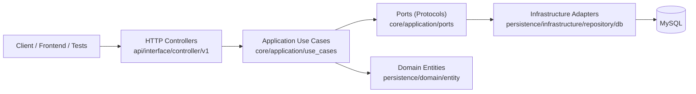

# Backend Guide

## Stack

- Framework: FastAPI
- ORM: SQLAlchemy
- DB driver: PyMySQL
- Testing: pytest

## Architecture

The backend follows a hexagonal structure:

- Core domain and application: `backend/src/core`
- Domain entities: `backend/src/persistence/domain/entity`
- Use cases: `backend/src/core/application/use_cases`
- Ports (interfaces): `backend/src/core/application/ports`
- Application services and policies: `backend/src/core/application/services`,
  `backend/src/core/application/policies`
- Domain helpers and shared rules: `backend/src/core/domain`
- Infrastructure adapters: `backend/src/persistence/infrastructure`
- HTTP controllers: `backend/src/api/interface/controller/v1`

Controller contract models are organized under:

- Requests: `backend/src/api/interface/controller/v1/model/request`
- Responses: `backend/src/api/interface/controller/v1/model/response`

Controllers should stay thin: validate input, invoke a use case, map errors to HTTP responses.

Dependency wiring is centralized through FastAPI dependencies (for example,
`get_season_competition_use_case`) so endpoints avoid manual repository/use-case instantiation.

## Architecture Schema



## Layer Responsibilities (SOLID-Oriented)

### 1) Controllers (Interface Layer)

- Main responsibility:
  - Parse/validate HTTP input, enforce auth dependencies, map use-case errors to HTTP status codes, return response DTOs.
- SOLID alignment:
  - `S` (Single Responsibility): only transport concerns.
  - `O` (Open/Closed): add new endpoints without changing use-case internals.
  - `D` (Dependency Inversion): depend on use-case abstractions/workflows, not SQL code.
- Must not do:
  - Business rules, SQL queries, transaction logic.

### 2) Use Cases (Application Layer)

- Main responsibility:
  - Orchestrate business flows, enforce application rules, coordinate domain objects through ports.
- SOLID alignment:
  - `S`: one use case class per business capability.
  - `O`: extend behavior with new use cases rather than mutating unrelated ones.
  - `D`: depend on port interfaces instead of concrete repositories.
- Must not do:
  - Framework-specific HTTP handling, direct ORM session operations in controllers.

### 3) Ports (Abstractions)

- Main responsibility:
  - Define contracts required by use cases (queries, commands, error semantics).
- SOLID alignment:
  - `I` (Interface Segregation): small, purpose-driven repository interfaces.
  - `D`: stable boundary so application stays independent from infrastructure.
- Must not do:
  - SQL or persistence implementation details.

### 4) Adapters / Repositories (Infrastructure Layer)

- Main responsibility:
  - Implement ports using SQLAlchemy and map persistence details to application DTOs/errors.
- SOLID alignment:
  - `S`: persistence only.
  - `L` (Liskov): any adapter implementing a port should be safely replaceable (e.g., DB mock, alternate storage).
- Must not do:
  - HTTP concerns or endpoint-level validation.

### 5) Domain Entities (Domain Layer)

- Main responsibility:
  - Represent core business concepts and invariant data model.
- SOLID alignment:
  - `S`: entity behavior/data integrity in one place.
  - `O`: evolve domain with new entities/value objects without breaking unrelated flows.
- Must not do:
  - Framework dependencies (FastAPI, request/response objects).

## Dependency Rule

Dependencies should point inward:

- Controllers -> Use Cases -> Ports <- Adapters
- Application/domain rules in `core` stay independent from infrastructure details.
- SQLAlchemy entities remain in `persistence/domain/entity` and are consumed through ports/adapters.

This keeps high-level policy stable while allowing infrastructure details to change.

## Identifiers

API contracts expose GUIDs, not internal numeric IDs.

- Example: `/api/v1/penas/{pena_guid}`

## Environment Variables

Source files:

- Template: `backend/config/.template.env`
- Local overrides: `backend/config/.local.env` (optional)
- Main env: `backend/config/.env`

Most relevant variables:

- `APP_HOST`, `APP_PORT`, `APP_RELOAD`, `APP_ENV`
- `EXPOSE_INTERNAL_ERRORS` (default `false`; enables detailed 500 responses only for local/dev/test)
- `DB_HOST`, `DB_PORT`, `DB_NAME`, `DB_USER`, `DB_PASSWORD`, `DB_PROVIDER`
- `LINK_TOKEN_TTL_SECONDS`, `SESSION_TTL_SECONDS`
- `SQL_ECHO`
- `ALLOWED_HOSTS`, `CORS_ALLOWED_ORIGINS`, `CORS_ALLOW_CREDENTIALS`
- `DB_STARTUP_MAX_ATTEMPTS`, `DB_STARTUP_RETRY_SECONDS`

## Run Backend

```bash
cd backend
python3 -m venv .venv
source .venv/bin/activate
pip install -r requirements.txt
python -m uvicorn src.main:app --host 0.0.0.0 --port 8000 --reload
```

## Ruff (Lint + Format)

The backend style standard is:

- Formatter: `ruff format`
- Lint: `ruff check` with `E`, `F`, and import sorting (`I`)
- `F401` is allowed only in `__init__.py` files for explicit re-exports

From repository root:

```bash
backend/.venv/bin/python -m ruff check backend/src backend/tests
backend/.venv/bin/python -m ruff format --check backend/src backend/tests
```

## Just Task Runner

`just` recipes are defined at repository root in `justfile`.

Common commands:

```bash
just bootstrap
just run-backend
just lint
just format
just test-unit
```

## Useful Commands

Run unit tests only:

```bash
cd backend
.venv/bin/python -m pytest tests --ignore=tests/integration -q
```

Run integration tests:

```bash
cd backend
.venv/bin/python -m pytest tests/integration -q
```
