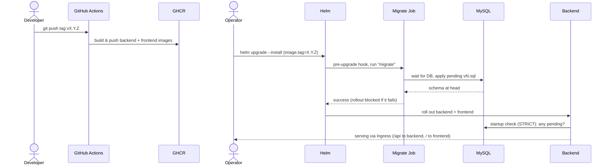
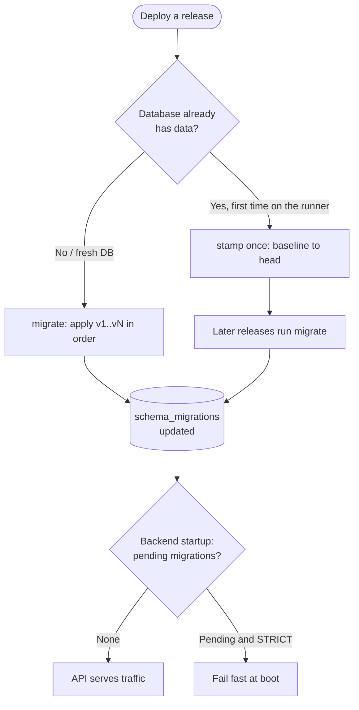

# Deployment & image generation

Target: **Kubernetes** (future scaling). Registry: **GHCR**. Images are built and
published on a **semver tag** (`vX.Y.Z`).

## Flow overview



The migration Job runs **before** the API rolls out and Helm blocks the release
until it succeeds, so the backend never serves against a stale schema (and refuses
to boot if it somehow would).

## Images

`./.github/workflows/release.yml` builds and pushes two images when you push a tag:

```bash
git tag v1.2.0
git push origin v1.2.0
```

| Image | Build context | Dockerfile |
|-------|---------------|------------|
| `ghcr.io/adrianoggm/footballhubmanager-backend` | repo root | `backend/docker/Dockerfile` |
| `ghcr.io/adrianoggm/footballhubmanager-frontend` | `frontend/` | `frontend/Dockerfile` |

Tags produced per release: `{{version}}` (e.g. `1.2.0`), `{{major}}.{{minor}}` (`1.2`),
`sha-<gitsha>`, and `latest`.

- **Backend** is built from the **repository root** so the image bundles both the
  app code (`backend/src`) and the SQL migrations (`versioning/sql`) the runner
  applies. It is a single image with multiple roles via its entrypoint:
  `serve` (default), `migrate`, `stamp [N]`, `status`.
- **Frontend** is a static SPA served by nginx on `:8080`. It is backend-agnostic;
  the Ingress routes `/api` to the backend Service and everything else to the
  frontend (the SPA calls `/api/v1/...` relative to its own origin).

## Database migrations (the production flow)

There is **no Alembic**. The schema is a forward-only series of
`versioning/sql/versions/vN.sql` files. The runner (`backend/src/db_migrations`)
tracks applied versions in `schema_migrations` and applies only the pending ones.

> The MySQL docker-entrypoint init (`actual.sql`) **only runs on an empty data
> volume**, so it cannot evolve a database that already holds production data.
> Production always evolves through the **runner**, never through the init script.



### Commands (image entrypoint, or `just` locally)

| Action | In a container | Locally |
|--------|----------------|---------|
| Show applied/pending | `status` | `just db-status` |
| Apply pending | `migrate` | `just db-migrate` |
| Baseline existing DB | `stamp [N]` | `just db-stamp [N]` |

### First rollout against an EXISTING production database

The current prod DB already has data and a schema (created from `actual.sql` and/or
manual `vN.sql`). Running `migrate` blindly would try to re-apply versions that are
physically present and fail. Do this **once**:

1. Back up the database (snapshot / `mysqldump`).
2. Baseline it so the runner knows what is already there:
   - If the schema matches the current head, `stamp` everything: `stamp`.
   - If it is at an older point, cap it: `stamp 9` (marks v1–v9 applied).
3. From then on, every deploy runs `migrate`, which applies only newer versions.

### Fresh database (new environment, CI, dev)

Either works:
- Let the runner build it from scratch: `migrate` applies `v1..vN` in order
  (`v1.sql` is the full base schema), **or**
- Use the fast init (`actual.sql` on an empty volume) and then `stamp` so the
  runner is in sync.

### Authoring a new migration

1. Add `versioning/sql/versions/vN.sql` (next number) with the `ALTER`/`CREATE`.
2. Add the same change to `versioning/sql/actual.sql` (keeps the fast-init/dev path current).
3. Update the relevant SQLAlchemy entity.
4. Do **not** self-insert into `schema_migrations` in new files — the runner records
   each applied version (older files v1–v8 self-record; the runner upserts idempotently).
5. Prefer idempotent DDL where practical. Note: MySQL auto-commits per DDL statement,
   so a multi-statement migration that fails midway cannot be fully rolled back —
   fix forward.

## Kubernetes wiring (next increment)

Run the migration as a **one-shot Job that completes before the API serves traffic**,
using the backend image with args `["migrate"]`:

- **Helm:** a Job annotated as a `pre-install,pre-upgrade` hook (recommended) — Helm
  blocks the rollout until it succeeds.
- **Plain manifests:** a `Job` gated by your deploy tooling, or an `initContainer` on
  the backend Deployment that runs `migrate` before the `serve` container starts.

The backend Deployment runs the default `serve`; the frontend Deployment serves nginx;
an Ingress maps `/api` → backend Service and `/` → frontend Service.

> The Helm chart (Deployments, Services, Ingress, the migrate hook Job, Secrets/Config)
> is the next step and depends on where MySQL lives (managed vs in-cluster).

## HTTPS / TLS

> For an end-to-end, copy-paste runbook on a single cheap VPS (k3s + ingress-nginx +
> cert-manager + this chart), see [vps-deployment.md](vps-deployment.md).

TLS terminates **at the Ingress**. Backend and frontend stay plain HTTP inside the
cluster (backend on `:8000`, nginx on `:8080`); only the ingress speaks HTTPS to the
internet. The pieces that make this work:

- **Backend trusts the proxy.** uvicorn runs with `proxy_headers=True` and
  `forwarded_allow_ips` (override via `FORWARDED_ALLOW_IPS`, default `*`). It reads
  `X-Forwarded-Proto`/`-For` from the ingress, so `request.url.scheme` is `https` and
  Swagger/redoc and any generated URLs use the right scheme. `*` is safe here because
  the only thing that can reach the pod is the in-cluster ingress.
- **Frontend uses a relative API base** (`VITE_API_BASE_URL` defaults to `""`), so the
  SPA calls `/api/...` on its own origin and automatically inherits `https://`. No
  mixed content, and the PWA service worker (which *requires* HTTPS in production) works.
- **Auth is Bearer-token, not cookies** — there are no `Secure`/`SameSite` cookie flags
  to set.

### Enable TLS with cert-manager (recommended)

Requires [cert-manager](https://cert-manager.io/) installed and a `ClusterIssuer`
(e.g. `letsencrypt-prod`). The chart adds the `cert-manager.io/cluster-issuer`
annotation; cert-manager issues and renews the cert into `ingress.tls.secretName`.

```yaml
# values-prod.yaml (excerpt)
ingress:
  enabled: true
  className: nginx
  host: app.example.com
  tls:
    enabled: true
    secretName: footballhub-tls
    clusterIssuer: letsencrypt-prod
  forceHttpsRedirect: true   # turn on AFTER the cert is issued (avoids redirect loop)
  hsts:
    enabled: true            # turn on once HTTPS is stable

app:
  env: production
  allowedHosts: "app.example.com"
  corsAllowedOrigins: "https://app.example.com"
```

```bash
helm upgrade --install footballhub ./deploy/helm/footballhub -f values-prod.yaml
```

Bring TLS up in two steps to avoid locking yourself out while the cert is pending:
first deploy with `tls.enabled=true` but `forceHttpsRedirect=false`; once
`kubectl get certificate` shows `Ready=True`, enable `forceHttpsRedirect` (and `hsts`).

### Enable TLS with a pre-provisioned certificate

Skip `clusterIssuer` and create the secret yourself (corporate CA, wildcard, etc.):

```bash
kubectl create secret tls footballhub-tls --cert=tls.crt --key=tls.key
helm upgrade --install footballhub ./deploy/helm/footballhub \
  --set ingress.tls.enabled=true --set ingress.host=app.example.com
```

> The redirect/HSTS annotations are written in the `nginx.ingress.kubernetes.io/*`
> form. On a different ingress controller, set the equivalent via `ingress.annotations`
> and leave `forceHttpsRedirect`/`hsts` off.
