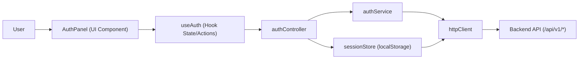

# Frontend Guide

## Stack

- React 18
- Vite 5
- Material UI 5

## Purpose

The current frontend is an authentication playground used to exercise backend endpoints for:

- User login/register
- Admin login/register
- Session token persistence and logout
- Nationality catalog loading for user registration

## Architecture Overview

The frontend follows a lightweight layered design:

- UI layer: React components (`App`, `AuthPanel`)
- State/behavior layer: custom hook (`useAuth`)
- Orchestration layer: controller (`authController`)
- API layer: service classes (`authService`, `httpClient`)
- Persistence layer (client-side): `sessionStore` (localStorage token)

## Architecture Schema



## Module Responsibilities

### Entry and App Shell

- `frontend/src/main.jsx`
  - Boots React, registers MUI `ThemeProvider`, applies `CssBaseline`.
- `frontend/src/App.jsx`
  - Defines the page shell and mounts `AuthPanel`.

### Presentation Layer

- `frontend/src/components/AuthPanel.jsx`
  - Renders login/register forms.
  - Handles form field state and submit actions.
  - Loads nationalities using `httpClient.get('/api/v1/catalogs/nationalities')`.
  - Displays auth errors and current token state.

### State/Behavior Layer

- `frontend/src/hooks/useAuth.js`
  - Owns auth UI state (`idle`, `loading`, `authenticated`, `error`).
  - Exposes high-level actions (`loginUser`, `loginAdmin`, `registerUser`, `registerAdmin`, `logout`).
  - Initializes token from `sessionStore` on mount.

### Orchestration Layer

- `frontend/src/services/authController.js`
  - Coordinates auth service calls and token persistence.
  - Writes/clears token via `sessionStore`.

### API/Transport Layer

- `frontend/src/services/authService.js`
  - Maps auth operations to backend routes:
  - `/api/v1/auth/login`
  - `/api/v1/auth/admin/login`
  - `/api/v1/auth/register`
  - `/api/v1/auth/admin/register`
  - `/api/v1/auth/logout`
- `frontend/src/services/httpClient.js`
  - Central HTTP wrapper around `fetch`.
  - Handles JSON parsing, error normalization, and `Authorization: Bearer <token>` injection.
  - Uses `VITE_API_BASE_URL` when defined.

### Client Persistence

- `frontend/src/services/sessionStore.js`
  - Stores token in `localStorage` (`penahub.session.token`).
  - Syncs token into `httpClient` so all requests can include auth automatically.

## Styling and Theme

- Theme: `frontend/src/theme.js`
  - Custom palette, typography, and shape via MUI theme.
- Global styles: `frontend/src/index.css`
  - Root typography and background gradient.

## Build/Runtime Configuration

- Vite config: `frontend/vite.config.js`
  - React plugin
  - PWA plugin (`vite-plugin-pwa`) with app manifest
  - Dev proxy:
    - `/api` -> `http://localhost:8000`
  - This avoids CORS issues in local development when backend runs on port `8000`.

## Key Files

- Package file: `frontend/package.json`
- Source code: `frontend/src`
- Public assets: `frontend/public`

## Run Frontend

```bash
cd frontend
npm install
npm run dev
```

## Other Commands

Build production bundle:

```bash
npm run build
```

Preview build locally:

```bash
npm run preview
```

## Environment Variables

- `VITE_API_BASE_URL` (optional):
  - If set, `httpClient` prefixes all requests with this value.
  - If empty, requests are relative and usually resolved through Vite proxy in dev.
